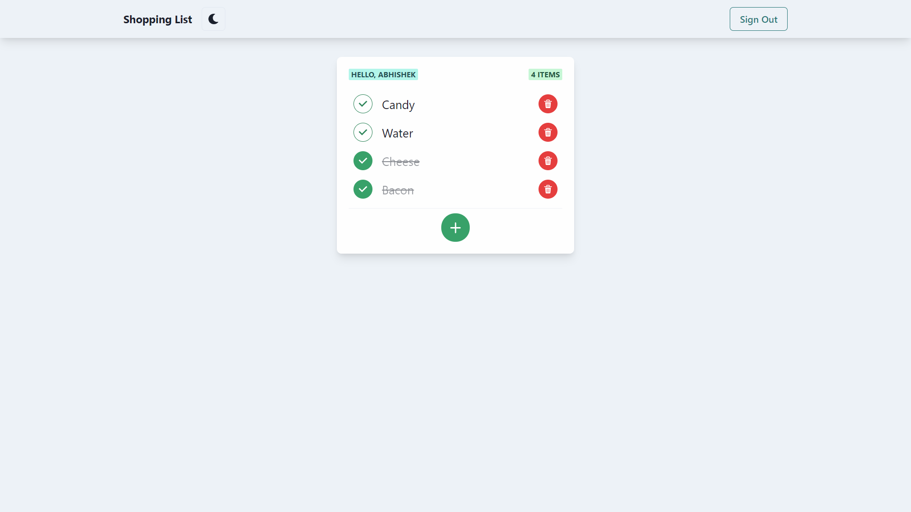

# MERN Shopping List

> Shopping list app built with the MERN stack along with Redux Toolkit for state management and Chakra-UI.

[https://polar-harbor-77503.herokuapp.com/](https://polar-harbor-77503.herokuapp.com/)



## Quick Start

### Env Variables

Create a config.env file in the config folder and add the following

```
NODE_ENV = development
PORT = 5000
MONGODB_URI = your mongodb uri
jwtSecret = 'abc123'
```
### Install Dependencies (frontend & backend)

```bash
# Install dependencies for server
npm install

# Install dependencies for client
npm run client-install
```

### Run

```bash
# Run the client & server with concurrently
npm run dev

# Run the Express server only
npm run server

# Run the React client only
npm run client

# Server runs on http://localhost:5000 and client on http://localhost:3000
```
